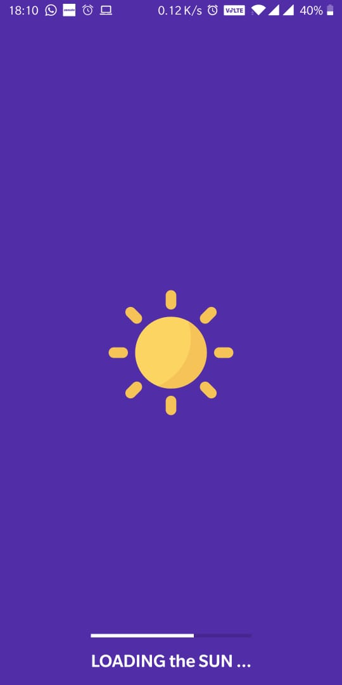
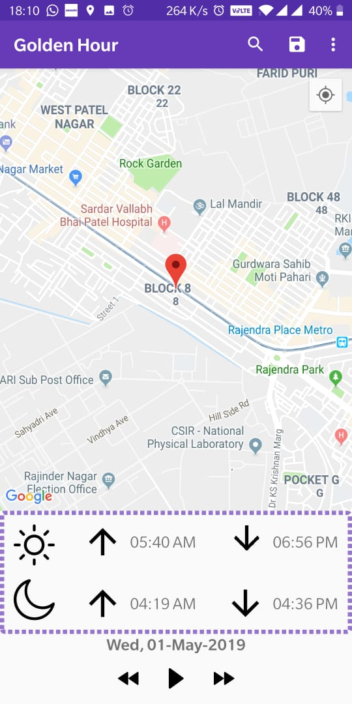
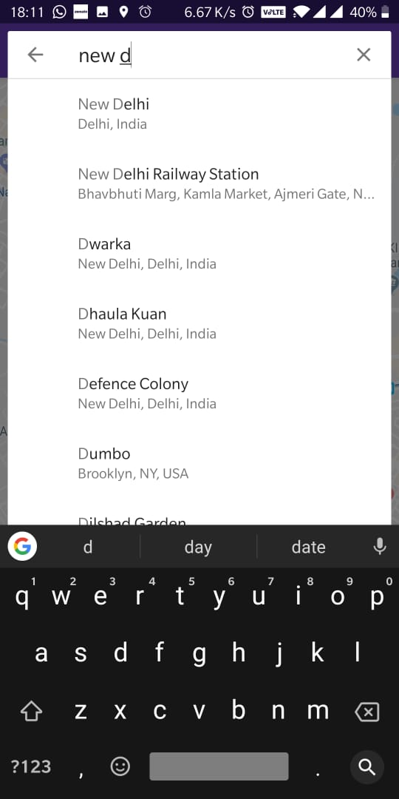
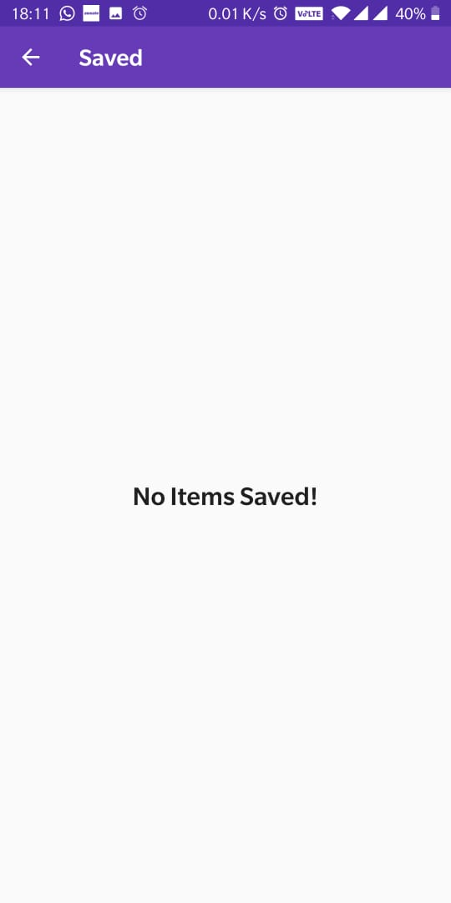
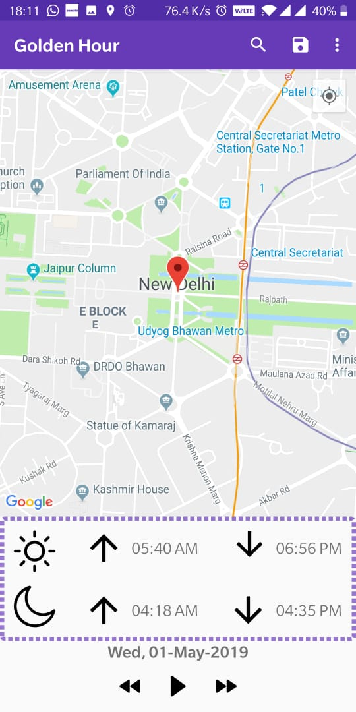
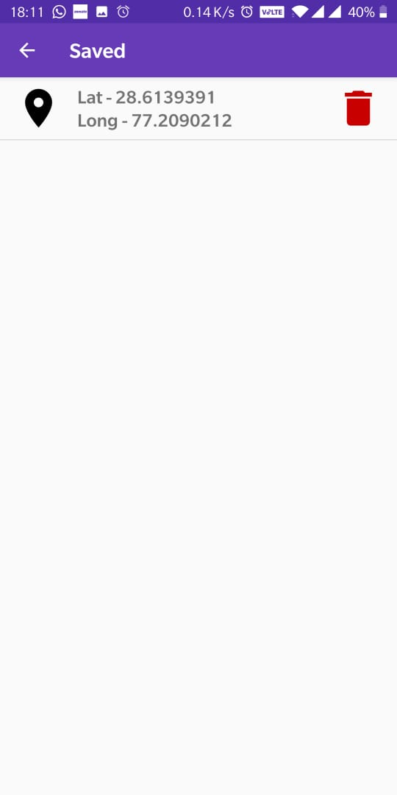

# GoldenHour
Application that Sends Notification 1 hour Prior to the Golden Hour. 

## What is Golden Hour?
In photography, the golden hour is the period of daytime shortly after sunrise or before sunset, during which daylight is redder and softer than when the Sun is higher in the sky. 
The opposite period during twilight is blue hour, just before sunrise or after sunset, when indirect sunlight is evenly diffused.
(slapped straight from Wikipedia)

## APIs
* Google Maps SDK
* Places SDK
* Room and LiveData

## Screenshots

</img>
</img>
</img>
</img>
</img>
</img>
